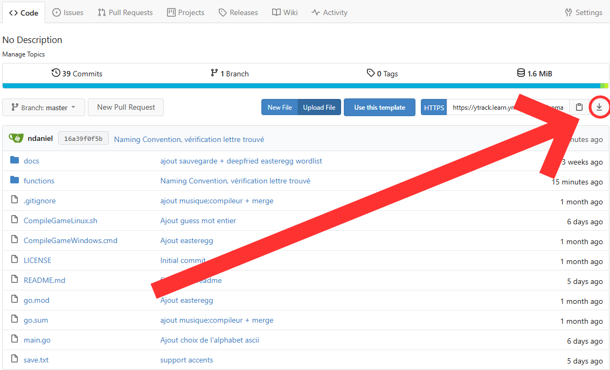

# 💀 Hangman Deluxe (Projet Hangman)
Ce Projet est un travail réalisé en groupe de 3 pour notre première année d'étude à Ynov.<br>
Il s'agit d'un simple jeu du pendu. L'objectif est de deviné le mot à l'écran en ne voyant que le nombre de caractère et d'espace. À chaque érreur, le nombre de tentative augmente et un dessin d'un pendu se dessine. Quand le dessin du pendu est complet le joueur à perdu.<br>
## 🚨Liste des Fonctionnalités
- ⭐ **Une interface** qui se nettoie à la quand l'on arrête le jeu.
- 💾 **Support de sauvegarde simple** : à l'arrêt du jeu, la partie en court est sauvegardé pour être continuer plus tard.
- 🎲 **Mots aléatoires** : Chaques parties peut avoir un mot à deviner différent.
- 🔡 **Affichage en ASCII** : Affichage du mot en ASCII par défaut, avec possibilité de changé de style
- 🚮 **Un easter-egg** : Pour ceux qui veulent plus de difficulté tout en s'ammusant.<br>
## 📦 Installation
Premièrement il vous faut installer la dernière version dans la branche `main` en cliquant sur le bouton entourner : (voir image ci-dessous)
</br>
Il est aussi possible d'utiliser la commande ci-dessous si vous possédez git :
```bash
git clone https://ytrack.learn.ynov.com/git/comaxime/hangman.git
cd hangman
```
Ensuite, pour pouvoir jouer au jeu il faut tout d'abord compiler le jeu, pour cela il faut simplement exécuter le code ci-dessous dans un bash en fonction de votre OS :
- Windows : `./CompileGameWindows.cmd`
- Linux : `sh CompileGameLinux.sh`
## 🚀 Lancement
Une fois le jeu compilé, l'exécutable `Hangman.exe` apparaîtra. Celui-ci accepte plusieurs options : 
```bash
./Hangman.exe [options]
```
## ⚙️ Options
- `--startWith <savefile>` : Reprend une partie sauvegardée grâce au fichier de sauvegarde fournie.
- `--letterFile <letterfile>` : Permet de jouer en utilisant l'alphabet ASCII fournit.<br>(Si aucun n'est fournit le jeu utilise `standard.txt` par défaut)
- `-df` : Pour ceux qui veulent y risquer leur audition et leur santé mentale.
## 🧑‍💻 Utilisation
**1. Lancer le jeu sur une nouvelle partie** :
```bash
./Hangman
```
**2. Lancer le jeu sur une sauvegarde `save.txt`** :
```bash
./Hangman --startWith "save.txt"
```
**3. Lancer le jeu avec un fichier ASCII spécifique** comme `shadow.txt` :
```bash
./Hangman --letterFile "docs/shadow.txt"
```
**4. Lancer le jeu sur une sauvegarde avec un fichier ASCII spécifique** :
```bash
./Hangman --startWith "save.txt" --letterFile "docs/shadow.txt"
```
**5. Lancer le jeu en ayant pour but de souffrir** :
```bash
./Hangman -df
```
## 📁 Fichier du Projet
- **main.go** : Fichier principale du projet, contient aussi la gestion des options.
- **functions/file_tools.go** : Logic de gestion des fichiers du jeu. 
- **functions/game_manager.go** : Logic de gestion du déroulement du jeu.
- **docs/** : Dossier contenant toutes les ressources nécessaire au jeu comme les police ASCII, les musiques, les images ASCII, et la liste de mots.
- **CompileGameLinux.sh** : Permet la compilation du jeu sur les machines utilisant Linux.
- **CompileGameWindows.cmd** : Permet la compilation du jeu sur les machines utilisant Windows.
## 💽 Sauvegarde
Afin de sauvegarder une partie en cours, il suffit simplement de taper `stop` dans le terminal en partie.

## 🎮 Choix Gameplay
Pour le jeu nous avons choisit de ne pas précisé le nombre de vie restant au joueurs mais de plutôt donner une couleur au pendu qui tourne du vert au rouge quand son nombre de vie diminu.<br>
Nous avons choisit d'utilisé une librairie externe à Golang afin de pouvoir ajouter une musique au jeu afin d'engagé le joueur au jeu. (La musique du jeu est propriété exclusif de `Kahoot!`, nous nous somme autorisé son utilisation car ce projet n'as pas objectif d'une publication et ne sert que de petit projet d'étude.)

## 📝 Licence
Ce projet est sous licence MIT. Consultez le fichier LICENSE pour plus de détails.

## 📞 Support
Pour toute question ou problème, vous pouvez ouvrir un [Ticket](https://ytrack.learn.ynov.com/git/comaxime/hangman/issues/new).
Veulliez ne pas nous contacter par mails.

## 🤖 Auteurs
Développé par [Maxime CORDONNIER](https://ytrack.learn.ynov.com/git/comaxime), [Daniel NAKAD](https://ytrack.learn.ynov.com/git/ndaniel), [Theo VERET](https://ytrack.learn.ynov.com/git/vtheo)<br>
Readme inspiré par [Kamel AKAR](https://fr.linkedin.com/in/kamel-akar-138024170)